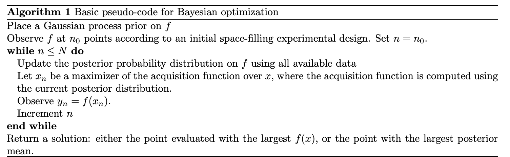

# Paper title

[Paper Link](https://arxiv.org/abs/1807.02811)

 

### Table of Contents
0. [Abstract](#abstract)
0. [Introduction](#introduction)
0. [Related Work](#relatedWork)
0. [Method](#method)
0. [Conclusion](#conclusion)
0. [Summary](#summary)

 

## Abstract

- Bayesian optimization is an approach to optimizing objective functions that take a long time (minutes or hours) to evaluate.
- Best suited : continuous domains of less than 20 dimensions.
- Tolerates stochastic noise in functions evaluations.
- Bayesian machine learning technique, Gaussian process regression.
- Composed of Surrogate function, Acquisition function.
- Describe 3 common acquistions functions : 
    1. expected improvement
    2. entropy search
    3. knowledge gradient
- This generalization is justified by a formal decision-theoretic argument, standing in contrast to previous ad hoc modifications.

 

## Introduction
- Bayesian optimization(BayesOpt) is a class of machine-learning-based optimization methods.

Objective function $\underset{x \in A}{max} f(x)$

Propertires:
- input $x$ is in $R^d, d\leq20$ is most successful applications of BayesOpt
- The feasible set A is simple set.hyper-rectangle $\{x\in{R^d}:a_i \leq x_i \leq b_i\}$ or d-dimensional simplex $\{x \in R^d: \sum_i x_i=1 \}$
 
- $f$ is continuous
- $f$ is **“expensive to evaluate”**
- $f$ lacks known special structure, **"black-box"**
- observe only f(x) and no first- or second-order derivatives
- assume f(x) is observed without noise, later we will allow $f(x)$ to be obscured by stochastic noise
- Our focus is on finding a *global* rather than local optimum

Received substantially more attention after EGO algorithm.

Multi-fidelity optimization specifically aimed at training deep neural networks and parallel methods.

**Two primary component**
- a method for statistical inference
- an acquisition function for deciding where to sample

We will check three alternate acquisition functions:
1. knowledge-gradient
2. entropy search
3. predictive entropy search

Exotic Bayesian optimization problems include those with parallel evaluations, constraints, multi-fidelity evaluations, multiple information sources, random environmental conditions, multi-task objectives, and derivative observations.

## Method
- Gaussian Process (GP) Regression

Whenever we have a quantity that is unknown in Bayesian statistics, we suppose that it was drawn at random by nature from some prior probability distribution.

GP regression takes this prior distribution to be multivariate normal.
 

## Conclusion
- 
    1. We do not currently have finite-time bounds that explain their near-optimal empirical performance. while Bull (2011) establishes a rate of convergence for expected improvement when it is combined with periodic uniform sampling, it is unknown whether removing uniform sampling results in the same or different rate.
    2. Bayesian optimization methods that leverage novel statistical approaches. It seems likely that classes of problems exist where the objective could be better modeled through other approaches.
    3. Work well in high dimensions is of great prac- tical and theoretical interest. It is also possible that new acquisition functions may provide substantial value in high dimensional problems.
    4. It is of interest to develop methods that leverage exotic problem structure unconsidered by today’s methods.
    5. substantial impact in a variety of fields seems possible through application of Bayesian opti- mization.
    
 

## Summary
- A variety of codes for Bayesian optimization and Gaussian process regression.

        [CRAN](https://cran.r-project.org/web/packages/DiceOptim/index.html) 
        [GPyOpt](https://github.com/SheffieldML/GPyOpt) 
        [MOE](https://github.com/Yelp/MOE) 
        [Cornell MOE](https://github.com/wujian16/Cornell-MOE) 
        [Spearmint](https://github.com/HIPS/Spearmint) 
        [DACE](http://www2.imm.dtu.dk/projects/dace/) 
        [GPFlow](https://github.com/GPflow/GPflow) 
        [GPyTorch](https://github.com/cornellius-gp/gpytorch) 
        [laGP](https://cran.r-project.org/web/packages/laGP/index.html) 
