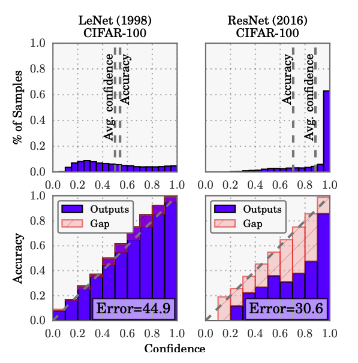
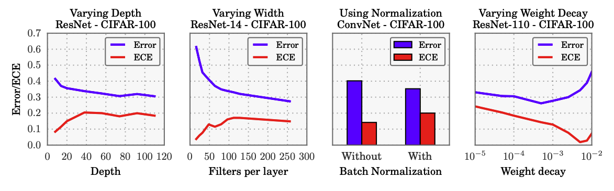
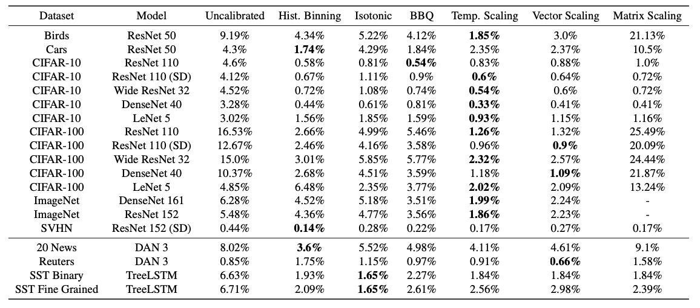
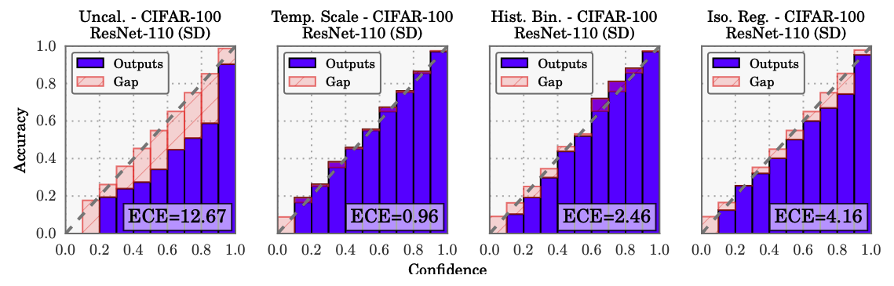

# "On Calibration of Modern Neural Networks"

[Paper Link](https://arxiv.org/abs/1706.04599)  
[Github Link]()

 

### Table of Contents
0. [Abstract](#abstract)
0. [Introduction](#introduction)
0. [Definitions](#definitions)
0. [Miscalibration](#miscalibration)
0. [Methods](#methods)
0. [Results](#results)
0. [Summary](#summary)

 

## Abstract

- Confidence calibration
    -  the problem of predict- ing probability estimates representative of the true correctness likelihood
- Modern neural networks are poorly calibrated
- Depth, width, weight decay, and Batch Normalization are important factors influencing calibration
- recommend using temperature scaling

 

## Introduction

- The probability associated with the predicted class label should reflect its ground truth correctness likelihood
- mod- ern neural networks are no longer well-calibrated

Figure 1. Confidence histograms (top) and reliability diagrams (bottom) for a 5-layer LeNet (left) and a 110-layer ResNet (right) on CIFAR-100

Paper's goal is not only to understand why neural networks have become miscalibrated, but also to identify what methods can alleviate this problem  
find that a single-parameter variant of Platt scaling which we refer to as temperature scaling is often the most effective method at obtaining calibrated probabilities

 

## Definitions

- Reliability Diagrams
- Expected Calibration Error (ECE)

Figure 2. The effect of network depth (far left), width (middle left), Batch Normalization (middle right), and weight decay (far right) on miscalibration, as measured by ECE (lower is better)

 

- Maximum Calibration Error (MCE)
- Negative log likelihood

## Miscalibration
- Model capacity  
- Batch Normalization
- Weight decay
- NLL

 

## Methods
- Histogram binning
- Isotonic regression
- Bayesian Binning into Quantiles (BBQ)
- Platt scaling (temperature)

Table 1. ECE (%) (with M = 15 bins) on standard vision and NLP datasets before calibration and with various calibration methods. The number following a model’s name denotes the network depth

 

## Results
- Temperature scaling outperforms all other methods on the vision tasks, and performs comparably to other methods on the NLP datasets
- The only dataset that temperature scaling does not calibrate is the Reuters dataset
- Because this dataset is well-calibrated to begin with (ECE ≤ 1%)

Figure 4. Reliability diagrams for CIFAR-100 before (far left) and after calibration (middle left, middle right, far right)

## Summary
 It remains future work to understand why these trends affect cali- bration while improving accuracy  
 Temperature scaling is the simplest, fastest, and most straightforward of the methods, and surprisingly is often the most effective  