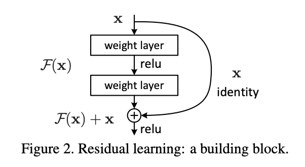

# "Deep Residual Learning for Imaghe Recognition"

[Paper Link](http://arxiv.org/abs/1512.03385) \
[Github Link](https://github.com/KaimingHe/deep-residual-networks)

 

### Table of Contents
0. [Abstract](#abstract)
0. [Introduction](#introduction)
0. [Related Work](#related-Work)
0. [Method](#method)
0. [Experiments](#experiments)
0. [Conclusion](#conclusion)

 

## Abstract

- Deep neural network model
    - 152 layers
- A residul learning framework
    - explicitly reformulate the layers as learn- ing residual functions with reference to the layer inputs
- An ensemble of residual nets achives 3.57% error on the ImageNet test set    

 

## Introduction
- the “levels” of features can be enriched by the number of stacked layers (depth)
- An obstacle : the notorious problem of vanishing/exploding gradients
    - Previous works, normalized initialization and intermediate normalization layers
- Problem : Deeper networks are able to start converging, a degradation problem has been exposed
    - Degradtion problem is not caused by overfitting

Figure 1. 56-layers network is worse than 20-layers

- Introduce a deep residual learning framework : $F(x) = H(x) - x$, identity shorcut connection
    - Shortcut connections are those skipping one or more layers, but here simply perform identity mapping
    - Instead of hoping each few stacked layers directly fit a desired underlying mapping
    - Original mapping is recast into $F(x) + x$

Figure 2. Residual learning framework (builing block)

- Deep residual nets are easy to optimize and can easily enjoy accuracy gains from greatly increased depth

 

## Related Work

### - Residual Representation
### - Short Connections

 

## Method

 

### Residual learning

 

Consider $H(x)$ as an underlying mapping to be fit by a few stacked layers (not necessarily the entire net), with x denoting the inputs to the first of these layers.

Then the remainder layers excluded "a few stacked layers part" learn feature about $H(x) - x$.

Let every layer in deep nerual network approximates a residual function $F(x) := H(x) - x$. The original functions become $F(x) + x$.

If identity mappings are optimal, the solvers may simply drive the weights of the multiple nonlinear lay- ers toward zero to approach identity mappings.

Figure 7. layer response is smaller as layers deeper

It means that identity mappings provide reasonable preconditioning

 

### Identity Mapping by shorcuts

 

The shortcut connections in $y = F(x,{W_i}) + x$ introduce neither extra parameter nor computation complexity.

Generally, $y = F(x,{W_i}) + W_{s}x$, ($W_s$ linear projection to match th dimensions)\
But experiments show the identity mapping is sufficient and economical.

Figure 5. Several residual buliding block by layers depth

The form of the residual function $F$ is flexible. \
Experiments in this paper involve a function $F$ that has two or three layers (Figure. 5)

 

### Network Architectures

 

Plain Network. VGG-19

Figure 3. Example network architectures

 

### Implementation

 

- The image is resized with its shorter side randomly sampled in for scale augmentation
- A 224⇥224 crop is randomly sampled from an image or its horizontal flip, with the per-pixel mean subtracted
- The standard color augmentation is used.
- Batch Normalization(BN) used right after each convolution and before activation
- initialize the weights and train all plain/residual nets from scratch
- SGD
- mini-batch size : 256
- The learning rate from 0.1 and divided by 10 when the error plateaus
- Epoch : $60*10^4$
- weight decay : 0.0001
- momentum : 0.9

 

## Experiments

 

### ImageNet classification

Plain Networks.

First evaluate 18-layer and 34-layer plain nets. The 34-layer plain net is in Fig. 3 (middle).

Table 2. Plain models comparison

Figure 4. Comparison plain and Resnet acc, val (ImageNet)

Look at the left-side of figure 4. \
Paper argue that this optimization difficulty is unlikely to be caused by vanishing gradients.

Table 3. Error rates with several models

In fact, the 34-layer plain net is still able to achieve competitive accuracy (Table 3) \
Paper conjectures that the deep plain nets may have exponentially low convergence rates.
The reason for such opti- mization difficulties will be studied in the future.
Otherwise, ResNet-34 is higer accuracy than ResNet-18 unlike plain model.

### Residual Networks

Next evaluate 18-layer and 34- layer residual nets (ResNets).

Table 4,5. ResNet accruacy comparision.

### Identity vs Projection Shorcuts

Table 3. See A B C options

In Table 3, compare three options:

(A) zero-padding shortcuts are used for increasing dimensions, and all shortcuts are parameter free\
(B) projection shortcuts are used for increasing dimensions, and other shortcuts are identity\
(C) all shortcuts are projections.

Projection shortcuts are not essential for addressing the degradation problem. \
Identity shortcuts are not increasing the complexity of the bottleneck architectures.

### Deeper Bottlebeck Architectures

Figure 5. Several residual buliding block by layers depth

50-layer ResNet : 3-layer bottleneck block \
101-layer and 152-layer ResNets : 3-layer bottleneck block

Lower complexity than VGG-19 and higher accuracy.

### CIFAR-10 and Analysis

Figure 6. Comparion plain and Resnet train, test acc (CIFAR-10)

Exploring over 1000 layers.

"no optimization difficulty"

The testing result of this 1202-layer network is worse than that of our 110-layer network, although both have similar training error.\
It may be occured by overfitting. Since 1202 layers are too deep for small dataset.

-> Need strong regularzier
## Conclusion
- None
