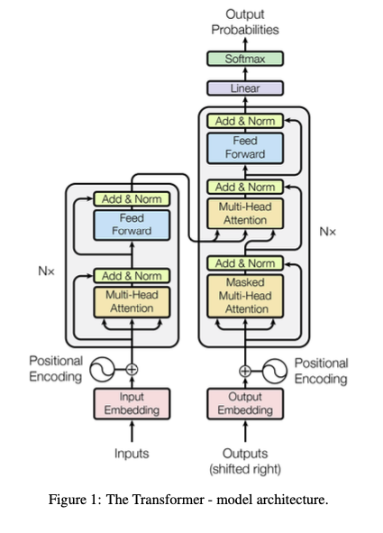
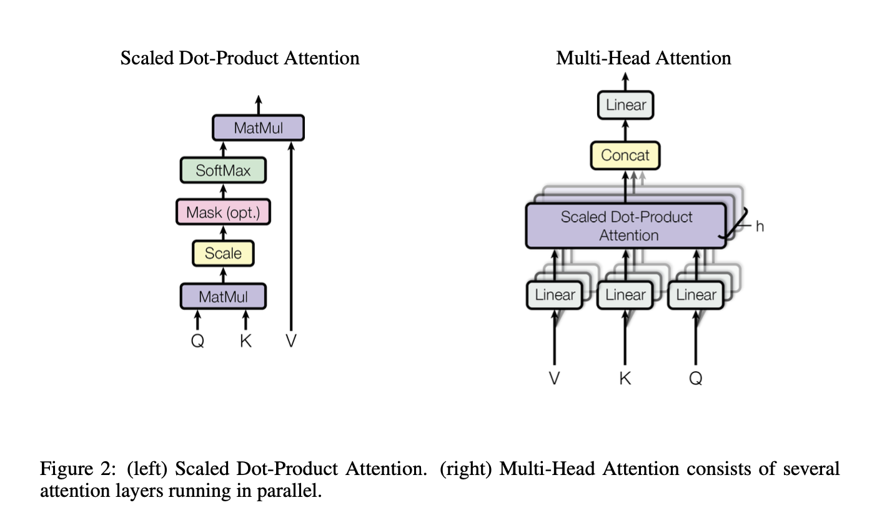

# "Attention Is All You Need"

[Paper Link](https://arxiv.org/abs/1706.03762)  
[Github Link](https://github.com/tensorflow/tensor2tensor)

 

### Table of Contents
0. [Abstract](#abstract)
0. [Introduction](#introduction)
0. [Related Work](#relatedWork)
0. [Method](#method)
0. [Conclusion](#conclusion)
0. [Summary](#summary)
0. [Appendix](#appendix)

 

## Abstract

- Sequence transduction models
- The best performing models connect the encoder and decoder through an attention mechanism
- Propose simple network based soley on attention mechanisms
- Parallelizable

 

## Introduction

- Traditional Recurrent models : critical at longer sequence lengths
- Recent work : factorization trick, conditional computation
- Fundamental constraint remains -> sequential computation

 

## Related Work

### - Self-attention(intra-attention)
### - End-to-end memory networks based on a recurrent attention mechanism

 

## Method

- Encoder-Decoder structure

### Encoder 
Input : sequence of symbol representation $(x_1,...,x_n)$  
Output : sequence of continous representation $z = (z_1,...,z_n)$

### Decoder
Input : $z$

Output : Symbols one element at a time $(y_1,...,y_m)$
#
Both the encoder and decoder have stacked self-attention and point-wise, fully connected layers

Figure 1. model architecture

### Encoder
Identical layer : 6  
Each layer : 2 sub-layers (multi-head self-attention mechanism, position wise fully connected feed-forward network)  
A residual connection each sub-layer : $LayerNorm(x+Sublayer(x))$

Output dimensions : 512

### Decoder
Identical layer : 6  
Each layer : 3 sub-layers (masked multi-head attention, multi-head attention, position wise fully connected feed-forward network)  
A residual connection each sub-layer : $LayerNorm(x+Sublayer(x))$  

### Attention
Mapping a query and a set of key-value pairs to an output  
Output : weighted sum of values from query-key operation

### Postional Encoding
$PE_{(pos,2i)}=sin(pos/10000^{2i/d_{model}})$  
$PE_{(pos,2i+1)}=cos(pos/10000^{2i/d_{model}})$
- Corresponds to a sinusoid
- The wavelengths form a geometric progression $2\pi$ to $10000 \cdot 2\pi$
- Represent well relative positions
- Additive / Concat
    - Concat represent more about positions
    - But need more computation than Additive
- Another methods : uniform, integer, etc

Figure 2. attention architecture

**Scaled Dot-Product Attention**

0. Embedding input
1. Q X K
2. Scale : divide $k^{1/2}$ (normalize)
3. Mask (optional)
4. Softmax : correlation within input words (attention)
5. Matmul with V : input X attention

Shortly $Attention(Q,K,V)=softmax(\frac{QK^T}{\sqrt{d_k}})V$

Two type of attention : addtive, dot-product  
- dot-product outperforms than dot product without scaling $\sqrt{d_k}$  
- To counteract this effect, scale by $\sqrt{d_k}$
- dot-product and additive are similar but dot-product is more faster than the other while two are similar in theoretical complexity

**Multi-Head Attention**
- Benenficial h heads attention than single head attention
- attention functions work parellel, outputs $d_v$ dimension values

shortly $MultiHead(Q,K,V)=Concat(head_1,\cdots,head_h)W^O \; where \; head_i=Attention(QW_i^Q,KW_i^K,VW_i^V)$  
Projections are parameter matrices $W_i^Q\in R^{d_{model}\times d_k},W_i^K\in R^{d_{model}\times d_k},W_i^V\in R^{d_{model}\times d_v},W^O\in R^{hd_v \times d_{model}}$  
In paper, $h=8, d_k=d_v=d_{model}/h=64$

- Total computational cost is similar to single-head attention with full dimensionality
 

### Application of Attention in paper
- encoder-decoder attention layers
    - queries come from the previous decoder
    - keys, values come from the output of encoder
    - attend over all positions, mimic seq2seq models
- self attention layers in encoder
    - self attention means Q,K,V come from same place, output of previous encoder
    - attend to all positions in the previous layers in encoder
- self attention layers in decoder
    - prevent leftward information flow in the decoder to preserve auto-regressive property
    - masking out all values($-\infty$) in the input of the softmax to illegal connecntions

### Why Self-Attention
1. Total computational complexity per layer
2. Can be parallelized
3. The path length between long-range dependencies

### Position-wise Feed-Forward Networks
$FFN(x)=max(0,xW_1+b_1)W_2+b_2$  
- Output is $d_{model}=512$, Inner-layer has $d_{ff}=2048$

### Embedding and Softmax
- Paper used learned embeddings to convert the input tokens and output tokens to vectors of dim($d_{model}$)
- Share same weight matrix between the two embedding layers and the pre-sftmax linear transformation
## Conclusion

- The first sequence transduction model based entirely on attention
- Replaced the recurrent layers most commonly used in encoder-decoder architectures with multi-headed self-attention
- Faster than architectures based on recurrent or convolutional layers

 

## Summary

- All you need is attention
- Positional encoding
- Attention mechanism with key, Query, Value
- Multi-head attention
- Diversity potentional of Transformer utilization

## Apendix
0. https://paul-hyun.github.io/transformer-01/
1. https://www.blossominkyung.com/deeplearning/transfomer-positional-encoding#4d058603-db0f-4d62-bb49-d85ea6dcbfc6
2. https://noru-jumping-in-the-mountains.tistory.com/9